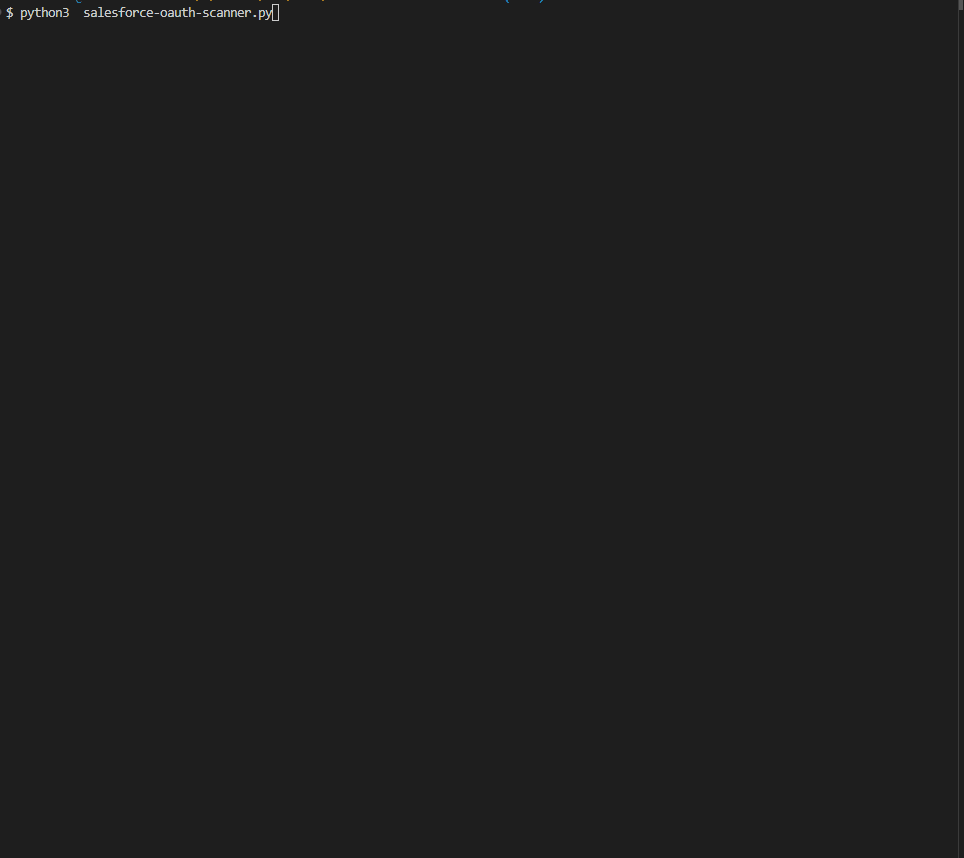

# Salesforce OAuth2 Device Code Flow Vulnerability Scanner

A Python-based security tool designed to test Salesforce instances for OAuth2 Device Code Flow vulnerabilities by attempting to authenticate with known client IDs.

## 🚨 What This Tool Does

This scanner tests Salesforce OAuth2 endpoints to identify instances that may be vulnerable to unauthorized OAuth2 device code flow authentication. It attempts to authenticate using known Salesforce client IDs and reports any instances that return valid authentication codes.



## ⚠️ Security Notice

**This tool is for authorized security testing and penetration testing purposes only.**
- Only use on systems you own or have explicit permission to test
- Unauthorized testing may violate terms of service and applicable laws
- Use responsibly and ethically

## 🔧 Prerequisites

- Python 3.6 or higher 
- Network access to the target Salesforce instance

## 📦 Installation

1. Clone or download this repository

## 🚀 Usage

### Basic Usage

```bash
python salesforce-oauth-scanner.py
```

The tool will prompt you to enter the Salesforce base URL.

### Command Line Usage

```bash
python salesforce-oauth-scanner.py https://your-instance.my.salesforce.com
```

### Example Output

```
 OAuth2 Device Code Flow Vulnerability Checker
============================================================
🔄 Converting lightning.force.com to my.salesforce.com
   Original: https://your-instance.lightning.force.com
   Normalized: https://your-instance.my.salesforce.com

🎯 Testing OAuth2 endpoints on: https://your-instance.my.salesforce.com
📋 Testing 6 client IDs...

[1/6] Testing client_id: PlatformCLI
  ✅ VULNERABLE! Found user_code: ABC123DEF

[2/6] Testing client_id: SfdcInsights
  ❌ No valid response

[3/6] Testing client_id: SfdcWaveWeb
  ❌ No valid response
...
```

## 🎯 What Gets Tested

The scanner tests the following known Salesforce Connected Apps with client IDs:

- `PlatformCLI` - Salesforce CLI
- `SfdcInsights` - Salesforce Analytics
- `SfdcWaveWeb` - Salesforce Wave
- `SfdcMobileChatteriOS` - Mobile Chatter iOS app
- `DataLoaderBulkUI/` - Data Loader Bulk UI
- `DataLoaderPartnerUI/` - Data Loader Partner UI

## 📊 Understanding Results

### Vulnerable Response
If a client ID is vulnerable, you'll see:
- ✅ **VULNERABLE!** message
- User code for authentication
- Device code
- Verification URI
- Polling interval

### Secure Response
If a client ID is secure, you'll see:
- ❌ **No valid response** or HTTP error codes
- No authentication codes returned

## 🔍 How It Works

1. **URL Normalization**: Automatically converts `lightning.force.com` URLs to `my.salesforce.com`
2. **OAuth2 Testing**: Sends POST requests to `/services/oauth2/token` endpoint
3. **Response Analysis**: Checks for valid OAuth2 device code flow responses
4. **Vulnerability Assessment**: Identifies instances that accept unauthorized client IDs

  
## 🔧 Customization

### Adding New Client IDs

Edit the `CLIENT_IDS` list in the script:

```python
CLIENT_IDS = [
    "PlatformCLI",
    "SfdcInsights", 
    "SfdcWaveWeb",
    "SfdcMobileChatteriOS",
    "DataLoaderBulkUI/",
    "DataLoaderPartnerUI/",
    "YourCustomClientID"  # Add new IDs here
]
```

### Modifying Request Parameters

Adjust the OAuth2 request payload in the `check_oauth2_endpoint` function:

```python
payload = {
    "scope": "refresh_token api",  # Modify scope as needed
    "response_type": "device_code",
    "client_id": client_id
}
```
  

## 🤝 Contributing

Contributions are welcome! Please ensure:
- Code follows existing style guidelines
- New features include appropriate error handling
- Security implications are considered
- Documentation is updated

## 📄 License

This project is licensed under the MIT License - see the [LICENSE](LICENSE) file for details.
 
## ⚠️ Disclaimer

This tool is provided "as is" without warranty. The authors are not responsible for any misuse or damage caused by this tool. Always obtain proper authorization before testing any system.

---

**Remember: With great power comes great responsibility. Use this tool ethically and legally.**
